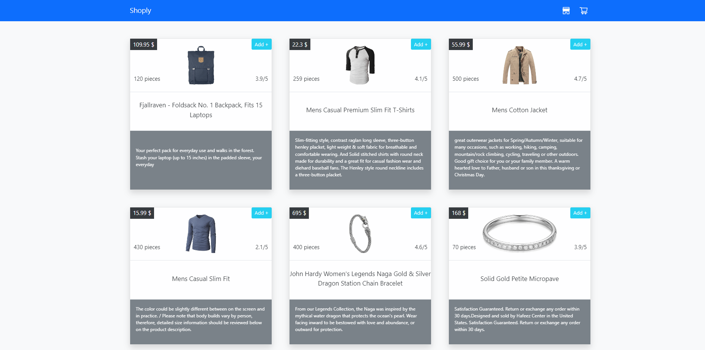

# Shopping-Cart 🛒

This project showcases a beautiful and user-friendly implementation of an e-commerce platform's user interface.

Deployment url : https://shoply-store.netlify.app



## Technologies

👉 REACT.JSX

👉 Bootstrap 5

## Implementation Remarks

1️⃣ I have added to the project 3 main components types that will help me perform the task in a simpler:

1. Welcome Page - A component that will greet users and provide a brief introduction to the website or application.
2. Catalog - A component that will display a comprehensive list of products or services offered by the website or application.
3. Shopping Cart - A component that will allow users to add products or services to a virtual shopping cart before proceeding to checkout. It will also display the total cost of the items in the cart.

2️⃣ I used the routing library 'react-router-dom' version v6.

3️⃣ I used the js-cookie library to save the items in the cookie memory.

## External libraries

🔹 React icons. React icons. 

🔹 React icons.

🔹 React toastify.

## Database I used

🔹 Github API.

## Usage

```
~$: npm i
~$: npm start
```

## for any questions

```
if(haveAnyQuestions === true){
    let yourName = ".......", question = ".......";
    sendEmailToMe(yourName,question,odedatias8115@gmail.com);
}
```
